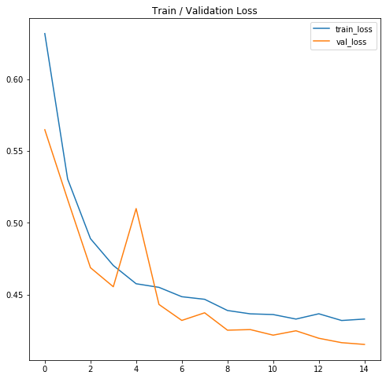
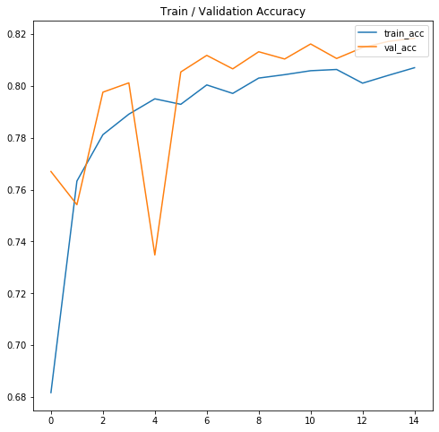
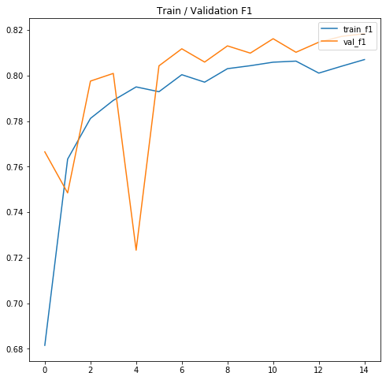
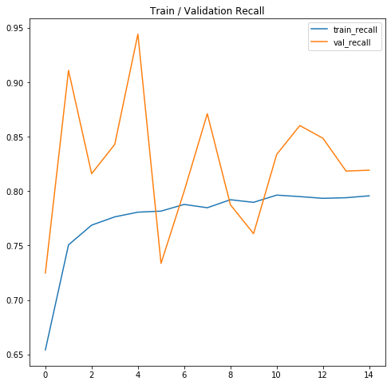
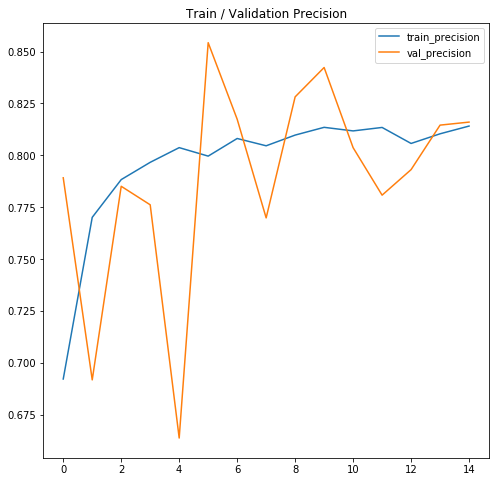
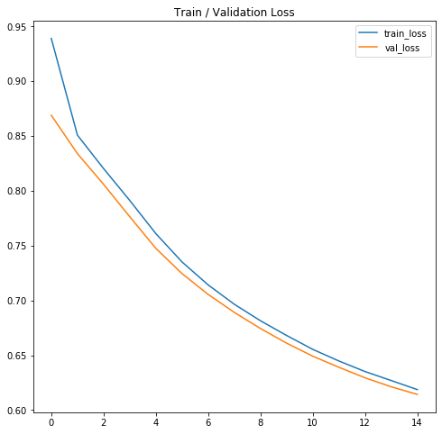
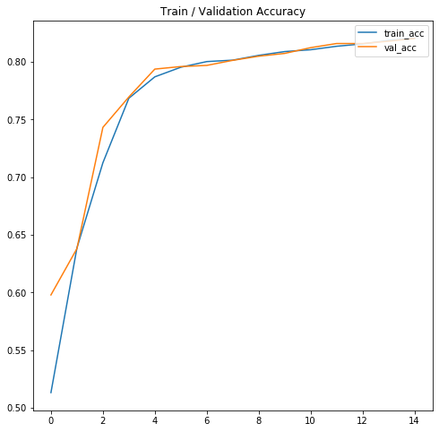
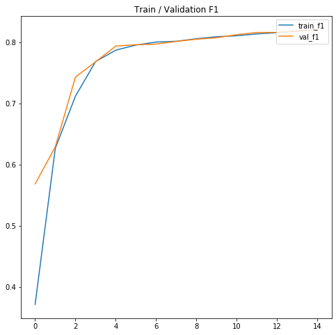
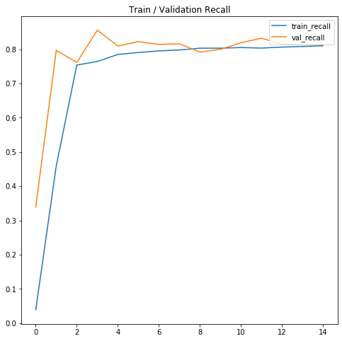
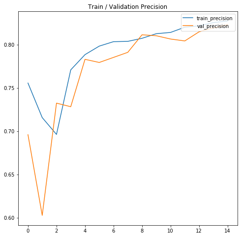

# space-model

## Experiments

```
epochs = 5
batch_size = 256
max_seq_len = 256
learning_rate = 2e-4
max_grad_norm = 1000
n_latent = 3
```

### Results Table:

| Metric             | BERT-base  | Space-model |
|--------------------|------------|-------------|
| Train Params       | 1538       | 4622        |
| Loss               | 0.5793     | 0.8092      |
| Accuracy           | 0.724      | **0.8175**  |
| F1-score (macro)   | 0.7213     | **0.8175**  |
| Precision          | 0.6841     | **0.8162**  |
| Recall             | **0.8349** | 0.8195      |
| Inter-space weight | N/A        | 0           |
| Intra-space weight | N/A        | 0           |

### IMDB Benchmark:

* DistilBERT (no fine-tuning)

| Metric                                            | Train Params | Loss   | Accuracy   | F1-score (macro) | Precision  | Recall     | Inter-space weight | Intra-space weight |
|---------------------------------------------------|--------------|--------|------------|------------------|------------|------------|--------------------|--------------------|
| Space-model (CE loss + inter-space + intra-space) | 4622         | 0.7293 | 0.7852     | 0.7843           | 0.8262     | 0.7231     | 0.2                | 0.001              |
| Space-model (CE loss)                             | 4622         | 0.4883 | 0.8080     | 0.8079           | 0.8262     | 0.7808     | 0                  | 0                  |
| Space-model (CE loss + inter-space)               | 4622         | 0.6503 | 0.7982     | 0.7976           | 0.8357     | 0.7431     | 0.2                | 0                  |
| Space-model (CE loss + intra-space)               | 4622         | 0.5762 | 0.7923     | 0.7922           | 0.8039     | 0.7739     | 0                  | 0.001              |
| Space-model (CE loss)                             | 197122       | 0.3855 | **0.8322** | **0.8320**       | 0.8093     | **0.8663** | 0                  | 0                  |
| DistilBERT-base-cased                             | 592130       | 0.4612 | 0.7852     | 0.7819           | **0.8799** | 0.6614     | N/A                | N/A                |

### 15 epochs (regularization & generalization study)

| Metric                                            | Train Params | Loss   | Accuracy   | F1-score (macro) | Precision  | Recall     | Inter-space weight | Intra-space weight |
|---------------------------------------------------|--------------|--------|------------|------------------|------------|------------|--------------------|--------------------|
| Space-model (CE loss + inter-space + intra-space) | 4622         | 0.6163 | 0.8192     | 0.8191           | 0.8270     | 0.8078     | 0.2                | 0.001              |
| Space-model (CE loss)                             | 4622         | 0.4230 | **0.8265** | **0.8264**       | **0.8313** | **0.8197** | 0                  | 0                  |
| DistilBERT-base-cased                             | 592130       | 0.4165 | 0.8171     | 0.8170           | 0.8178     | 0.8166     | N/A                | N/A                |

## HateXplain Dataset

### Zero-shot (2 labels)

| Metric                                            | Loss   | Accuracy   | F1-score (macro) | Precision  | Recall     | Inter-space weight | Intra-space weight |
|---------------------------------------------------|--------|------------|------------------|------------|------------|--------------------|--------------------|
| Space-model (CE loss + inter-space + intra-space) | 0.6662 | 0.5966     | 0.4994           | 0.5102     | 0.1918     | 0.2                | 0.001              |
| Space-model (CE loss + inter-space)               | 0.6676 | 0.5961     | 0.5046           | 0.5079     | 0.2046     | 0.2                | 0                  |
| Space-model (CE loss + intra-space)               | 0.6707 | 0.5821     | **0.5187**       | 0.4752     | **0.2698** | 0                  | 0.001              |
| Space-model (CE loss)                             | 0.6874 | 0.5977     | 0.5040           | 0.5130     | 0.2007     | 0                  | 0                  |
| DistilBERT-base-cased                             | 0.8529 | **0.6013** | 0.4450           | **0.5619** | 0.0869     | N/A                | N/A                |

### Head Fine-tuning  (3 labels)

| Metric                                            | Train Params | Loss   | Accuracy   | F1-score (macro) | Precision  | Recall     | Inter-space weight | Intra-space weight |
|---------------------------------------------------|--------------|--------|------------|------------------|------------|------------|--------------------|--------------------|
| Space-model (CE loss + inter-space + intra-space) | 6942         | 1.5546 | 0.4173     | 0.2225           | 0.3530     | 0.4173     | 0.2                | 0.001              |
| Space-model (CE loss)                             | 6942         | 0.9969 | **0.5296** | **0.4304**       | **0.5431** | **0.5296** | 0                  | 0                  |
| bert-base-cased                                   | 2307         | 1.0584 | 0.4485     | 0.3314           | 0.4471     | 0.4485     | N/A                | N/A                |

### 15 epochs (regularization & generalization study)

| Metric                                            | Loss   | Accuracy   | F1-score (macro) | Precision  | Recall     | Inter-space weight | Intra-space weight |
|---------------------------------------------------|--------|------------|------------------|------------|------------|--------------------|--------------------|
| Space-model (CE loss + inter-space + intra-space) | 0.7330 | 0.5935     | 0.5080           | 0.5000     | 0.2173     | 0.2                | 0.001              |
| Space-model (CE loss)                             | 0.7499 | 0.5961     | **0.5174**       | 0.5068     | **0.2365** | 0                  | 0                  |
| DistilBERT-base-cased                             | 0.8280 | **0.5966** | 0.4868           | **0.5119** | 0.1649     | N/A                | N/A                |

* XLNet (no fine-tuning)

| Metric                | Train Params | Loss   | Accuracy   | F1-score (macro) | Precision  | Recall     | Inter-space weight | Intra-space weight |
|-----------------------|--------------|--------|------------|------------------|------------|------------|--------------------|--------------------|
| Space-model (CE loss) | 4622         | 0.3188 | **0.8798** | **0.8797**       | **0.8764** | **0.8824** | 0                  | 0                  |
| XLNet-base-cased      | 1538         | 0.4319 | 0.8160     | 0.8156           | 0.8421     | 0.7750     | N/A                | N/A                |

* BERT (no fine-tuning)

| Metric                | Train Params | Loss   | Accuracy   | F1-score (macro) | Precision  | Recall     | Inter-space weight | Intra-space weight |
|-----------------------|--------------|--------|------------|------------------|------------|------------|--------------------|--------------------|
| Space-model (CE loss) | 4622         | 0.5149 | **0.8110** | **0.8108**       | **0.8227** | **0.7899** | 0                  | 0                  |
| BERT-base-cased       | 1538         | 0.6289 | 0.6588     | 0.6555           | 0.6919     | 0.5649     | N/A                | N/A                |

<!---### Bert Results:


### Space-model Results:


-->

## Regularization comparison (15 epochs)

### DistilBERT







### Space-model





